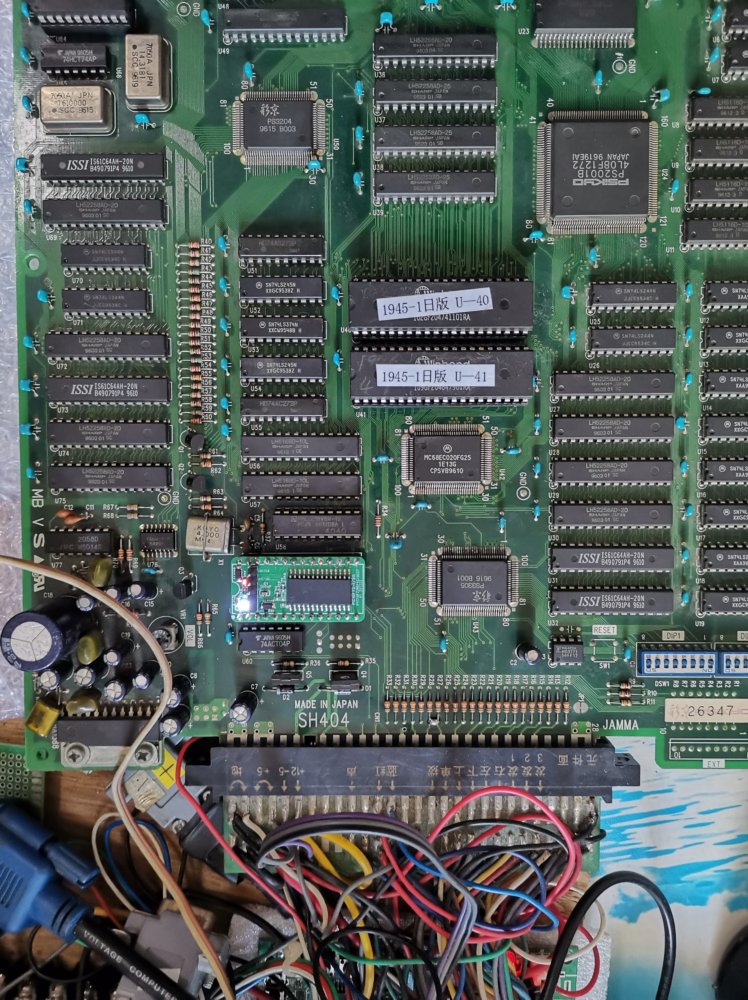
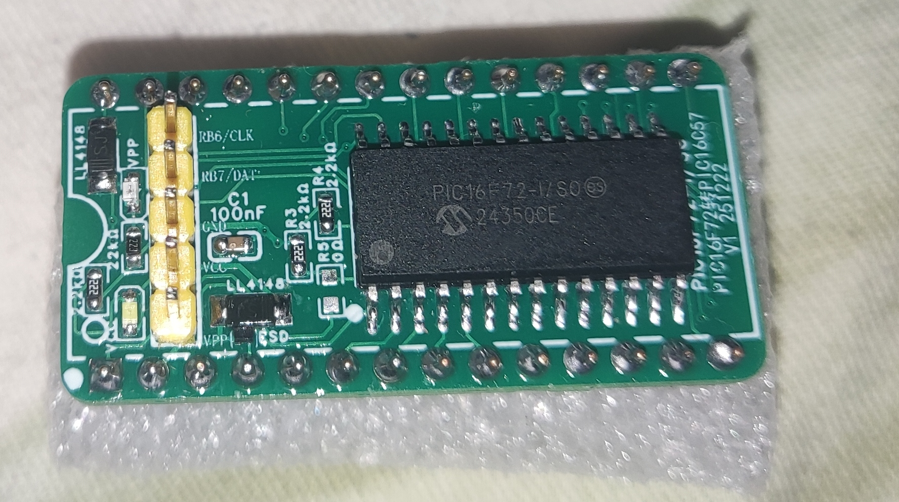
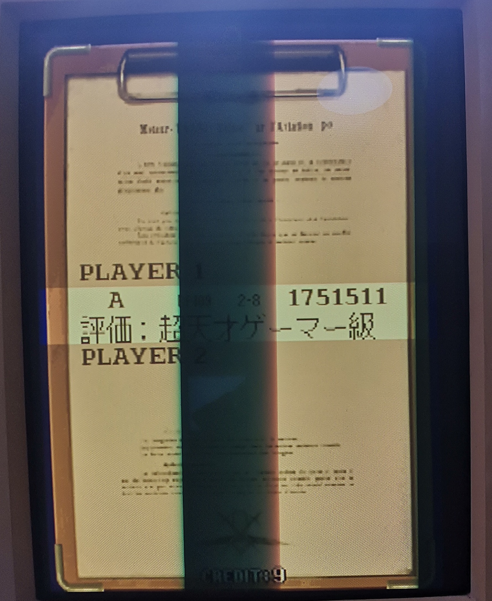
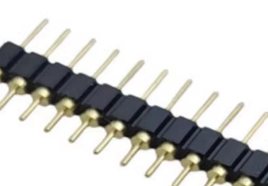

# Psikyo SH404 PCB PIC16C57 Replacement
Reverse engineering for Psikyo Strikers 1945&amp;Tengai PIC16C57,and replace PIC16C57 to PIC16F72

## Overview
The Psikyo SH404 arcade PCB utilizes a PIC16C57 microcontroller for security protection. 
When this chip fails, the PCB becomes stuck at the self-check screen during boot-up.

Since modern programmers (including K150 and Willem models) do not support the obsolete PIC16C57 or its nominal replacement PIC16F57, I reverse-engineered the original firmware binary using MAME emulation. The resulting assembly code was ported to a PIC16F72 microcontroller, successfully restoring PCB worked.

PIC16F72 to PIC16C57 PCB Notes:

1. R5 - Do NOT populate (left open)

2. D3 - ESD (strongely recommand)

3. use **round-pin headers**, **NOT square-pin headers**. Refer to the image 

*Use round-pin header*